<div align="center">



<br>

<a href="https://dns.elele.dev"></a>
<a href="#install"></a>
<a href="#whats-in-the-demo"></a>

<br><br>


</div>

<br>

> **[The demo][demo] is the real dashboard**, with real components, running real queries against a
> database that was invented on purpose. No household's DNS history is published there and none ever
> will be. This repository holds the documentation and the installer; the dashboard's source is not
> public.

[demo]: https://dns.elele.dev

<br>

## The argument, in one paragraph

Your resolver already blocks the ads. It just cannot tell you much about what it did: its query log
is a circular buffer that overwrites itself within the day, and its dashboard counts things rather
than explaining them. Its API, meanwhile, returns resolution time, upstream, cache status and the
matched rule, none of which its own interface shows. This reads that log continuously into a store
of its own, keeps ninety days of it, and turns the result into the thing the log was always
describing.

Works with **AdGuard Home or Pi-hole v6+**, chosen with `DNS_PROVIDER`. The analytics are identical
either way, because every screen reads this project's own store rather than passing anything
through. The two differ only where the resolvers themselves do: the control section, and the
destinations map, which needs answer addresses that Pi-hole's API does not report.

<br>

## What it answers that the stock dashboard does not

| | AdGuard Home | elele. DNS |
|---|---|---|
| **How much history** | a few hours, then overwritten | 90 days of detail, then hourly rollups that never expire |
| **Which device is that** | an IP and whatever name you typed | named devices, vendor from the MAC, a rhythm chart per hour of the week |
| **Who is on the other end** | hostnames | organisations, categories, and the domains that belong to them |
| **Where does it physically go** | not answered | every answer geolocated to a city, drawn live on a world map |
| **Is the blocking annoying anyone** | a blocked count | refusals grouped into episodes, so one refusal is not four hundred retries |
| **Why did that site break** | scroll and hope | a moment view: every lookup either side of an instant, retries marked |
| **Is a device bypassing me** | not answered | DoH resolver lookups and the Firefox canary, stated as intent rather than proof |
| **Which upstream is slow** | not answered | latency distribution per resolver, p50, p95 and the spread |

Fairness, because it matters: AdGuard Home is not the competition. It is the thing answering DNS,
it has the filtering engine and a decade of edge cases nobody wants to reimplement, and it is the
only one of the two that keeps working when the other is switched off.

<br>

## Install

One script. It installs AdGuard Home too if you do not already run one, wires the two together, and
hands back two URLs.

```bash
curl -fsSL https://dns.elele.dev/install.sh | sudo bash
```

Piping a URL into a root shell deserves a second's hesitation every time, so
[read it first](install.sh). It is 610 lines, and every section of it says what it is about to do
before it does it.

<details>
<summary><b>What it actually does</b></summary>

<br>

| Step | |
|---|---|
| **1** | Checks architecture, distribution and free disk. Warns rather than stops when the box is unusual. |
| **2** | Installs Docker from `get.docker.com`, after asking. |
| **3** | Installs AdGuard Home on the host network so it can bind port 53. If `systemd-resolved` is holding that port (the single most common reason a first install fails), it offers to move the stub listener out of the way. |
| **4** | Authenticates against `/control/status` **before** writing anything, so a wrong password fails in a script that can tell you rather than in a container that restarts forever. |
| **5** | Writes `.env` at `chmod 600` (it holds your admin password) and a compose file with the history bind-mounted somewhere you can back up. |
| **6** | Starts it, polls `/api/health` until it answers, then reports how many queries were ingested. |
| **7** | Tells you the one thing left: point your router's DNS at the box. |

</details>

<details>
<summary><b>Other ways to run it</b></summary>

<br>

```bash
# already running AdGuard Home
./install.sh --dashboard-only --agh-url http://192.168.1.10:3000

# see every step, change nothing
./install.sh --dry-run --with-adguard

# take every default, ask nothing
sudo ./install.sh --with-adguard --yes

# remove the dashboard, keep the history and the resolver
sudo ./install.sh --uninstall
```

</details>

<br>

> [!WARNING]
> There is no login. Anyone who can reach the address can read every DNS query the household has
> made. On a trusted LAN that is a reasonable trade for zero setup; on anything reachable from the
> internet it is not a trade, it is a leak. Put it behind a VPN or an authenticating proxy.

<br>

## What's in the demo

Sixteen devices with the names somebody would actually give them, resolving the domains those
devices actually resolve, at the hours they are actually awake:

```
Living room Apple TV   Kitchen Echo Show    Hunter's MacBook Pro   Hunter's iPhone
Nintendo Switch        Bedroom Samsung TV   Front door Ring        Hue bridge
Roborock S8            PlayStation 5        Kitchen Sonos          Pixel 8 (guest)
Brother printer        Synology NAS         Work ThinkPad          Model 3
```

The fixture was built to have something to say on every page, not just to fill charts:

- the **bedroom TV** hammers its content-recognition endpoint every evening, refused every time, which is what the Friction page is for
- the **guest Pixel** looks up DoH resolvers and the Firefox canary, which is what the bypass detector is for
- the **Model 3** went quiet three days ago, and the **Pixel** arrived three days ago
- one **upstream is deliberately slower** than the other two
- four domains **first appear in the last two days**, so the new-domain signal has something to find

<details>
<summary><b>How the fixture is built</b></summary>

<br>

Three weeks of traffic are generated per device, per hour, against a daily rhythm curve, then rolled
up hour by hour **by the product's own rollup pass**, then detail older than a week is deleted the
way retention does it. That is why the coverage seam in the interface is genuine rather than drawn
on: 24h is answered from per-query rows, longer windows from hourly aggregates.

The deploy build runs three stages, in this order:

| Stage | |
|---|---|
| **generate** | 418k queries → real rollups → prune to 7 days of detail |
| **snapshot** | extract the client-side JSON (stream, search, explorer) |
| **build** | prerender 411 pages against the fixture, emit `out/` |

Seeded throughout, so the same commit produces the same database. It reruns weekly, because the
fixture is anchored to the build clock: the demo is always the three weeks ending now, never a
preserved week from whenever it was last deployed.

</details>

<br>

## How the demo differs from the product

Everything here is static: no server runs behind the URL. Four things cost.

| | |
|---|---|
| **Range is fixed at 24h** | A static page cannot read `?range=7d`. The fixture still holds three weeks. |
| **Control and Alerts are gone** | Both write to a resolver, and there is no resolver here. |
| **The explorer filters a sample** | 2,500 recent rows, in the browser. Every link into it still works, and the page says which number you are looking at. |
| **The live stream is a replay** | Real fixture rows, stamped with the moment they appear. The components drawing them are the product's own, unmodified. |

Everything else is unchanged: the SQL, the schema, the rollups, the attribution, the geolocation,
the anomaly detectors, the friction analysis. If something looks wrong here, it is wrong there.

<br>

## Stack

Next.js 15 App Router · React 19 · TypeScript strict · Tailwind v4 with a token layer solved in
OKLCH · SQLite via better-sqlite3 with WAL, tuned for an SD card · Drizzle · Recharts and d3-geo ·
Motion. Contrast is a build check, not a comment: `npm run verify:contrast` solves every text role
against every ground it can land on and fails rather than warns.

<br>

<div align="center">
<sub>Not affiliated with AdGuard Software Limited. AdGuard Home is their trademark, used here to
identify the software this interoperates with.</sub>
</div>
